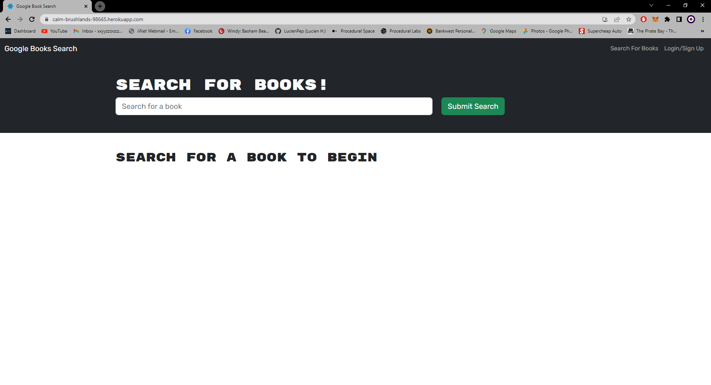

# Homework-Week-21
## Book Search Engine GraphQL

 My task was to take starter code with a fully functioning Google Books API search engine built with a RESTful API, and refactor it to be a GraphQL API built with Apollo Server.

### User Story
```
AS AN avid reader
I WANT to search for new books to read
SO THAT I can keep a list of books to purchase
```

### Table of Contents
1. [Acceptance Criteria](#acceptance-criteria)
2. [Work Description](#work-description)
3. [Deployed Site Link](#link-to-deployed-site)
4. [Screenshot](#screenshot)
5. [Installation](#installation)
6. [License](#license)
7. [Questions](#questions)

### Acceptance Criteria
```
GIVEN a book search engine
WHEN I load the search engine
THEN I am presented with a menu with the options Search for Books and Login/Signup and an input field to search for books and a submit button
WHEN I click on the Search for Books menu option
THEN I am presented with an input field to search for books and a submit button
WHEN I am not logged in and enter a search term in the input field and click the submit button
THEN I am presented with several search results, each featuring a book’s title, author, description, image, and a link to that book on the Google Books site
WHEN I click on the Login/Signup menu option
THEN a modal appears on the screen with a toggle between the option to log in or sign up
WHEN the toggle is set to Signup
THEN I am presented with three inputs for a username, an email address, and a password, and a signup button
WHEN the toggle is set to Login
THEN I am presented with two inputs for an email address and a password and login button
WHEN I enter a valid email address and create a password and click on the signup button
THEN my user account is created and I am logged in to the site
WHEN I enter my account’s email address and password and click on the login button
THEN I the modal closes and I am logged in to the site
WHEN I am logged in to the site
THEN the menu options change to Search for Books, an option to see my saved books, and Logout
WHEN I am logged in and enter a search term in the input field and click the submit button
THEN I am presented with several search results, each featuring a book’s title, author, description, image, and a link to that book on the Google Books site and a button to save a book to my account
WHEN I click on the Save button on a book
THEN that book’s information is saved to my account
WHEN I click on the option to see my saved books
THEN I am presented with all of the books I have saved to my account, each featuring the book’s title, author, description, image, and a link to that book on the Google Books site and a button to remove a book from my account
WHEN I click on the Remove button on a book
THEN that book is deleted from my saved books list
WHEN I click on the Logout button
THEN I am logged out of the site and presented with a menu with the options Search for Books and Login/Signup and an input field to search for books and a submit button 
```

---
[](https://opensource.org/licenses/MIT)

### Work Description

I started with the pre assigned code and worked on the back end to begin with I created teh resolvers and type defs created the needed queries and mutations, then configured the with file to work with graphQL I also added apollo-server to the Server.js.
After I had completed all the back end I moved onto the Front end and after revising how the apollo-client functions within the front end I began to write up the queries and mutations for front end use. I then configured the signupForm and loginForms files along with the savedBooks and searchBooks files. After completing these files I ran the code and had numerous issues which forced me to re-write the type-def queries and change how to page submitted the data. After working through more minor errors I was able to sign in and save books successfully 


### Link To Deployed Site

## [Week-21-Heroku-deployment](https://calm-brushlands-98665.herokuapp.com/)

### Screenshot



### Installation

For this application no dependencies need to be installed as a user on the deployed application.

### License

The license I am using for my project is<br>[MIT](https://opensource.org/licenses/MIT)

### Questions

GitHub: [Lucienpep](https://github.com/Lucienpep)<br>

For any further questions contact me via:

Email: <xxyyzzoozz@gmail.com>

---
Lucien Haines UADL 2023